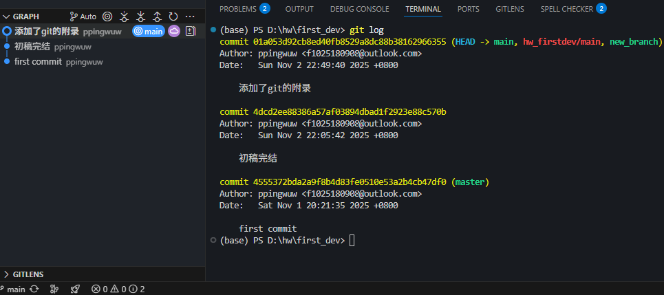

# git仓库搭建以及管理
我们需要做好版本管理，避免代码丢失或损坏。

程序员的经典笑话，诶，这又一个bug，修一下ing= =  
卧槽，代码怎么又报错了，还更多了T T  
我靠，完全运行不了了，完蛋了QAQ

*如果你没有存档，你要怎么回到那个美好的时刻呢^ ^？*
## 一、搭建git仓库的步骤
1. git简单介绍  
   Git 是一种分布式版本控制系统，用于管理软件项目的源代码。它是由 Linux 之父 Linus Torvalds 开发的，并已经成为了现代软件开发领域中最流行的版本控制系统之一。  
   
   使用 Git 可以追踪代码的历史修改记录，方便团队协作、代码共享和代码重构。Git 的基本工作流程如下：
- 在开始编写代码之前，首先需要创建一个 Git 仓库（repository），用于存储代码和版本历史记录。
- 在编写代码时，可以通过 git add 命令将更改的文件添加到 Git 的暂存区（staging area）中。
- 通过 git commit 命令将暂存区中的更改提交到 Git 仓库中，并生成一个新的版本号（commit hash）。
- 如果需要撤销某个提交，可以使用 git revert 命令来创建一个新的提交，该提交将会抵消先前的提交效果。
- 如果需要合并不同分支的代码，可以使用 git merge 命令进行合并。
- 如果需要查看代码的历史提交记录，可以使用 git log 命令来获取详细信息。
- 如果需要将代码推送到远程仓库，可以使用 git push 命令将本地代码推送到远程仓库。
- 如果需要从远程仓库中获取代码，可以使用 git pull 命令将远程代码拉取到本地。
  
  - Workspace：工作区
  - Index / Stage：暂存区
  - Repository：仓库区（或本地仓库）
  - Remote：远程仓库
1. 安装git  
  下载git安装包并安装[git官网链接](https://git-scm.com/install/)，设置仅仅需要注意下图，其他默认即可。  
    

1. 配置git  
   将git添加到环境变量中，方便在任何目录下使用git命令。（注意，一定要找到对应的git.exe文件路径，添加到环境变量中）  
   截图举例,图1是Git安装路径，图2是添加环境变量：
   
   
   
2. 创建git仓库以及常用指令  
   请在当前目录依次运行以下指令
   ```
   git init                      # 初始化一个新的git仓库
   git add .                     # 添加所有文件到暂存区
   git status                    # 查看当前仓库状态
   git commit -m "dev1"          # 提交暂存区的文件到仓库
   git log                       # 查看提交历史
   git branch                    # 查看当前分支以及所有分支
   git branch -m main            # 重命名默认分支为main

   # 以下为举例，请不要运行
   git branch <branch_name>      # 创建一个新的分支
   git checkout <branch_name>    # 切换到新创建的分支
   git reset HEAD~1              # 回退到上一个提交版本
   ```
   
## 二、上传git仓库至github的步骤
1. 注册github账号  
   略
2. 在github上创建一个新的仓库  
   截图举例：
   
3. 初始化本地仓库  
   在 （一、搭建git仓库的步骤） 中已经完成
4. 添加远程仓库（首次推送会要求登录GitHub，输入账号密码登入即可。）
   
   添加远程仓库的URL，其中`<remote-name>`是自定义名称（作用是存储remote-url，方便后续使用，即可以直接使用`<remote-name>`来代替`<remote-url>`），`<remote-url>`是远程仓库的URL：
   ```
   git remote add <remote-name> <remote-url>
   git remote add origin https://github.com/yourusername/yourrepository.git  # 请把yourusername和yourrepository替换为你自己的用户名和仓库名
   ```


5. 推送本地仓库至远程仓库  
   推送本地仓库的`<branch-name>`分支到远程仓库的`<remote-name>`分支，其中`<remote-name>`是远程仓库的名称，`<branch-name>`是本地仓库的分支名称。
   ```
   git push -u <remote-name> <branch-name>
   git push -u origin main     # 推送本地main分支到远程origin仓库的main分支，之前重命名为main的分支
   ```
## 附录
### git reset的使用
  git reset 是一个非常强大但也需要谨慎使用的 Git 命令，它的主要作用是将你的项目状态（包括提交历史、暂存区和工作区）回退到某个指定的提交（commit）。

  它就像一个“时光倒流”按钮，但根据你使用的选项不同，它会影响项目的不同层面。

---

### 📌核心概念：Git 的三个区域

在理解 `git reset` 之前，必须了解 Git 的三个关键区域：

1.  **`HEAD` (HEAD 指针)**：
    *   指向你当前所在的最后一次提交（commit）。
    *   位于 **`.git` 目录**中。

2.  **Index (暂存区 / Staging Area)**：
    *   你通过 `git add` 命令添加文件后，文件的快照会存放在暂存区。
    *   它是“工作区”和“HEAD”之间的缓冲区。

3.  **Working Directory (工作区)**：
    *   就是你在电脑上看到和编辑的文件。

`git reset` 的不同模式就是决定在回退时，**是否移动 `HEAD`、是否重置暂存区、是否重置工作区**。

---

### 🔧 `git reset` 的三种主要模式

#### 1. `git reset --soft <commit>`

*   **作用**：
    *   **移动 `HEAD` 指针**到指定的 `<commit>`。
    *   **保留**暂存区（Index）和工作区（Working Directory）的更改。
*   **结果**：
    *   你“撤销”了指定提交之后的所有**提交记录**。
    *   但这些提交中修改的文件，仍然处于“已暂存”状态（绿色），你随时可以重新提交。
*   **适用场景**：
    *   你刚提交了（`git commit`），但发现提交信息写错了，或者想把这次提交和下一次提交合并成一个。
    *   你想“撤销”一次提交，但保留所有改动，以便重新组织提交。

**示例**：
```bash
# 假设你刚提交了一次，现在想撤销这次提交，但保留改动
git reset --soft HEAD~1
# 现在，你之前提交的更改会回到“已暂存”状态，你可以 git commit --amend 来修改上次提交
```

#### 2. `git reset --mixed <commit>` (这是 git reset 的默认行为)

*   **作用**：
    *   **移动 `HEAD` 指针**到指定的 `<commit>`。
    *   **重置暂存区（Index）**到该提交的状态（即，取消所有 `git add` 的操作）。
    *   **保留工作区（Working Directory）**的文件更改。
*   **结果**：
    *   你“撤销”了指定提交之后的所有提交记录。
    *   你修改的文件内容还在，但它们从“已暂存”状态变回了“已修改未暂存”状态（红色），你需要重新 `git add` 才能提交。
*   **适用场景**：
    *   这是最常用的模式。当你想撤销一些提交，并重新组织你的更改时。
    *   你添加了太多文件到暂存区，想全部取消暂存，可以用 `git reset --mixed`（不加 `<commit>` 默认是 `HEAD`）。

**示例**：
```bash
# 假设你添加了多个文件到暂存区，想全部取消暂存，但保留工作区的修改
git reset --mixed
# 或者更常见的简写
git reset
```

#### 3. `git reset --hard <commit>`

⚠️ 警告：这是最危险的模式！
*   **作用**：
    *   **移动 `HEAD` 指针**到指定的 `<commit>`。
    *   **重置暂存区（Index）**到该提交的状态。
    *   **彻底重置工作区（Working Directory）**，丢弃所有未提交的更改。
*   **结果**：
    *   你“撤销”了指定提交之后的所有提交记录。
    *   所有未提交的修改（无论是暂存的还是未暂存的）都会被永久删除，无法通过常规 Git 命令找回。
*   **适用场景**：
    *   你尝试了一些实验性代码，搞得很乱，想彻底放弃所有更改，回到一个干净的状态。
    *   你确定不再需要某个提交之后的所有更改。

**示例**：
```bash
# 假设你想彻底放弃所有未提交的更改，回到最后一次提交的状态
git reset --hard
# 或者回退到前3次提交之前的状态，并丢弃所有中间的更改
git reset --hard HEAD~3
```
所有未提交的修改（无论是暂存的还是未暂存的）都会被永久删除，无法通过常规 Git 命令找回。
适用场景：
你尝试了一些实验性代码，搞得很乱，想彻底放弃所有更改，回到一个干净的状态。
你确定不再需要某个提交之后的所有更改。

**示例**：
```bash
# 假设你想彻底放弃所有未提交的更改，回到最后一次提交的状态
git reset --hard
# 或者回退到前3次提交之前的状态，并丢弃所有中间的更改
git reset --hard HEAD~3
```

使用示例总结

假设你的提交历史是：
```text
A <- B <- C <- D (HEAD)
```
你当前在 D 提交，想回退到 B 提交。

|命令|结果|
|--|--|
|`git reset --soft B`|HEAD 指向 B。提交 C 和 D 的更改在暂存区（绿色）。你可以立即 `git commit` 创建一个新提交。|
|`git reset --mixed B`|HEAD 指向 B。提交 C 和 D 的更改在工作区（红色，未暂存）。你需要 `git add` 和 `git commit`。|
|`git reset --hard B`|HEAD 指向 B。提交 C 和 D 的更改全部丢失。工作区和暂存区都和 B 提交时完全一样。|

**重要警告**

- 不要在已推送的提交上使用 --hard：如果你已经将提交推送到远程仓库（如 GitHub），然后使用 git reset --hard 修改了历史，再推送时会遇到麻烦。其他协作者的仓库会与你的不一致。这种情况下，应该使用 git revert 来创建一个“反向提交”，而不是 reset。
- `--hard` 是不可逆的：一旦执行 git reset --hard，被丢弃的更改很难恢复（虽然 Git 有 reflog 可以尝试找回，但很复杂）。

### 总结

|选项|移动 HEAD|重置暂存区|重置工作区|安全性|常用场景|
|--|--|--|--|--|--|
|`--soft`|✅|❌|❌|⭐⭐⭐⭐|修改提交历史，重新提交|
|`--mixed` (默认)|✅|✅|❌|⭐⭐⭐|取消暂存，重新组织更改|
|`--hard`|✅|✅|✅|⭐|彻底放弃更改，回到干净状态|

简单记忆：
- `--soft`: 只改历史，不碰文件。
- `--mixed` (默认): 改历史，清暂存区，留文件。
- `--hard`: 全部重置，文件也没了。
## 参考文献
- Git 使用教程：最详细、最正宗手把手教学（万字长文）（[csdn](https://blog.csdn.net/qq_16027093/article/details/130503317)
- 【清晰教程】利用Git工具将本地项目push上传至GitHub仓库中（[csdn](https://blog.csdn.net/weixin_73404807/article/details/148345290)