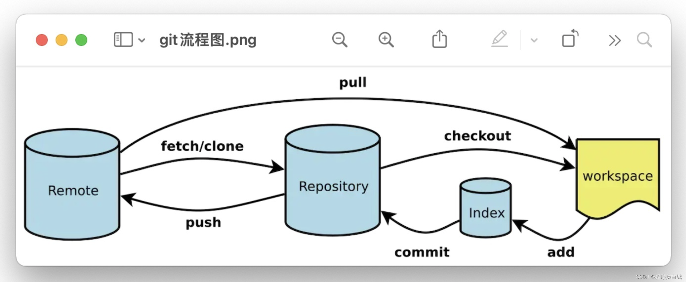
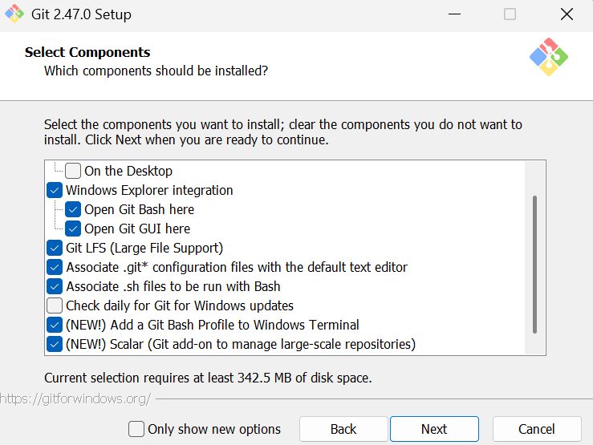
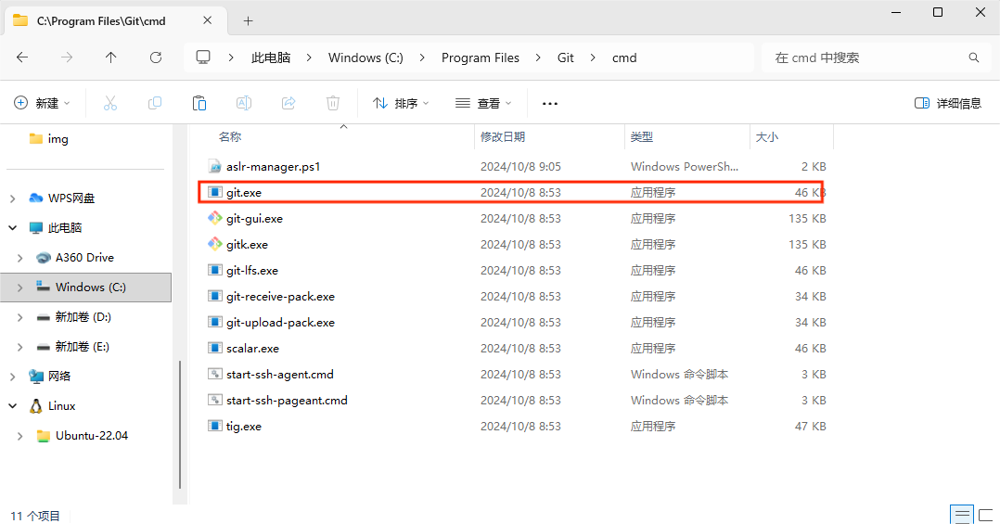
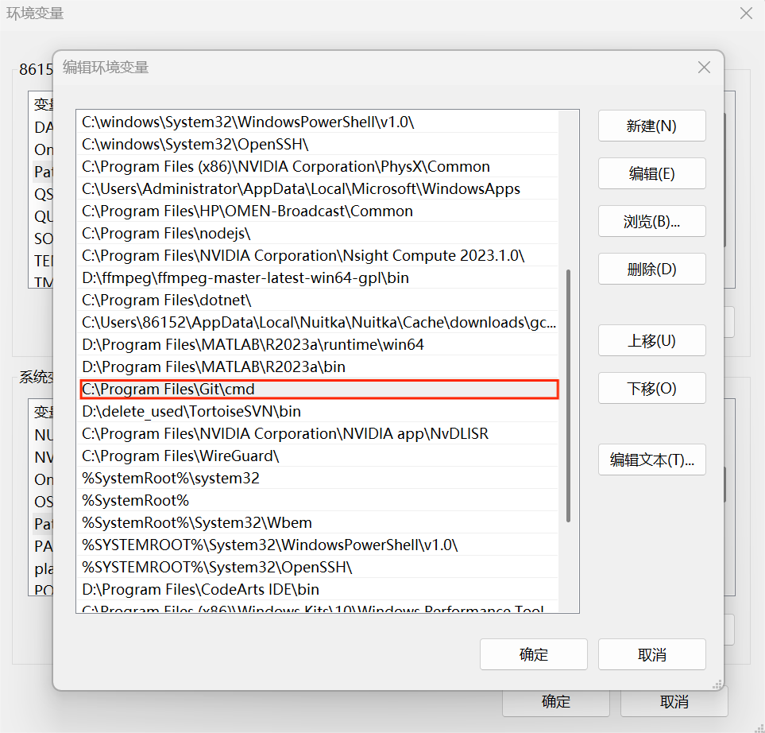
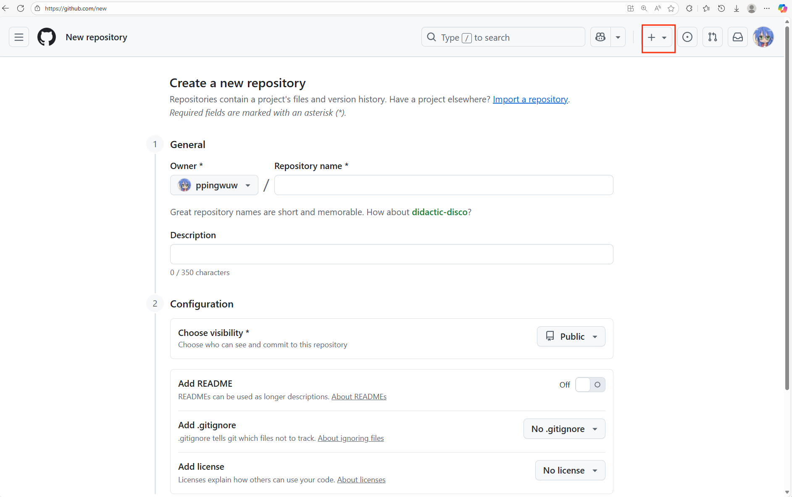

# git仓库搭建以及管理
## 一、搭建git仓库的步骤
1. git简单介绍  
   Git 是一种分布式版本控制系统，用于管理软件项目的源代码。它是由 Linux 之父 Linus Torvalds 开发的，并已经成为了现代软件开发领域中最流行的版本控制系统之一。  
   
   使用 Git 可以追踪代码的历史修改记录，方便团队协作、代码共享和代码重构。Git 的基本工作流程如下：
- 在开始编写代码之前，首先需要创建一个 Git 仓库（repository），用于存储代码和版本历史记录。
- 在编写代码时，可以通过 git add 命令将更改的文件添加到 Git 的暂存区（staging area）中。
- 通过 git commit 命令将暂存区中的更改提交到 Git 仓库中，并生成一个新的版本号（commit hash）。
- 如果需要撤销某个提交，可以使用 git revert 命令来创建一个新的提交，该提交将会抵消先前的提交效果。
- 如果需要合并不同分支的代码，可以使用 git merge 命令进行合并。
- 如果需要查看代码的历史提交记录，可以使用 git log 命令来获取详细信息。
- 如果需要将代码推送到远程仓库，可以使用 git push 命令将本地代码推送到远程仓库。
- 如果需要从远程仓库中获取代码，可以使用 git pull 命令将远程代码拉取到本地。
  
  - Workspace：工作区
  - Index / Stage：暂存区
  - Repository：仓库区（或本地仓库）
  - Remote：远程仓库
1. 安装git  
  下载git安装包并安装[git官网链接](https://git-scm.com/install/)，设置仅仅需要注意下图，其他默认即可。  
    

1. 配置git  
   将git添加到环境变量中，方便在任何目录下使用git命令。（注意，一定要找到对应的git.exe文件路径，添加到环境变量中）  
   截图举例,图1是Git安装路径，图2是添加环境变量：
   
   
   
2. 创建git仓库以及常用指令  
   请在当前目录依次运行以下指令
   ```
   git init                      # 初始化一个新的git仓库
   git add .                     # 添加所有文件到暂存区
   git status                    # 查看当前仓库状态
   git commit -m "dev1"          # 提交暂存区的文件到仓库
   git log                       # 查看提交历史
   git branch                    # 查看当前分支以及所有分支
   git branch -m main            # 重命名默认分支为main

   # 以下为举例，请不要运行
   git branch <branch_name>      # 创建一个新的分支
   git checkout <branch_name>    # 切换到新创建的分支
   ```

## 二、上传git仓库至github的步骤
1. 注册github账号  
   略
2. 在github上创建一个新的仓库  
   截图举例：
   
3. 初始化本地仓库  
   在 （一、搭建git仓库的步骤） 中已经完成
4. 添加远程仓库（首次推送会要求登录GitHub，输入账号密码登入即可。）
   
   添加远程仓库的URL，其中`<remote-name>`是自定义名称（作用是存储remote-url，方便后续使用，即可以直接使用`<remote-name>`来代替`<remote-url>`），`<remote-url>`是远程仓库的URL：
   ```
   git remote add <remote-name> <remote-url>
   git remote add origin https://github.com/yourusername/yourrepository.git  # 请把yourusername和yourrepository替换为你自己的用户名和仓库名
   ```


5. 推送本地仓库至远程仓库  
   推送本地仓库的`<branch-name>`分支到远程仓库的`<remote-name>`分支，其中`<remote-name>`是远程仓库的名称，`<branch-name>`是本地仓库的分支名称。
   ```
   git push -u <remote-name> <branch-name>
   git push -u origin main     # 推送本地main分支到远程origin仓库的main分支，之前重命名为main的分支
   ```